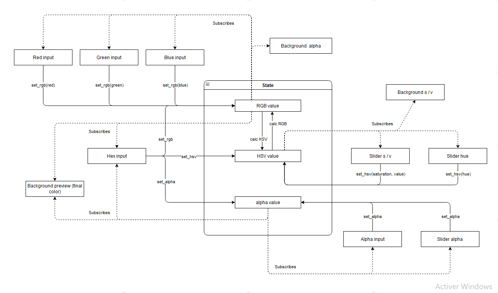

# HSV Color Picker

Simple HSV color picker in HTML.

- **V 1.0.0**

    - Update of DOM elements is done declaratively in a single js file.

- **V 1.1.0**

    - Added a state management system with a publish-subscribe pattern for DOM elements.

- **V 2.0.0**

    - Webpack added and configured.
    - Jest configured :

        - Webpack config is specified as a COmmonJS module (`.cjs` extension).
        - Module imports have their extension specified when importing.

## State & Interactions

The following graph modelizes the component's state management system.
 
All state variables are shown with their subscriptions and all actions towards a change in the state.

